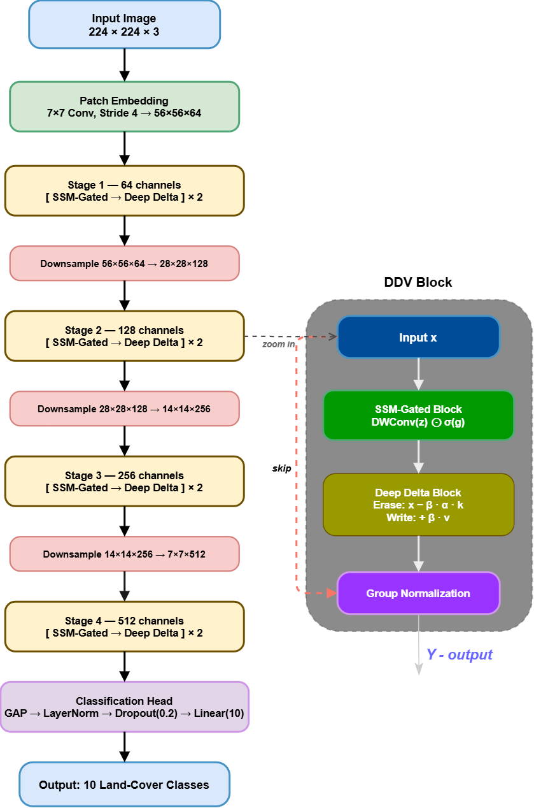
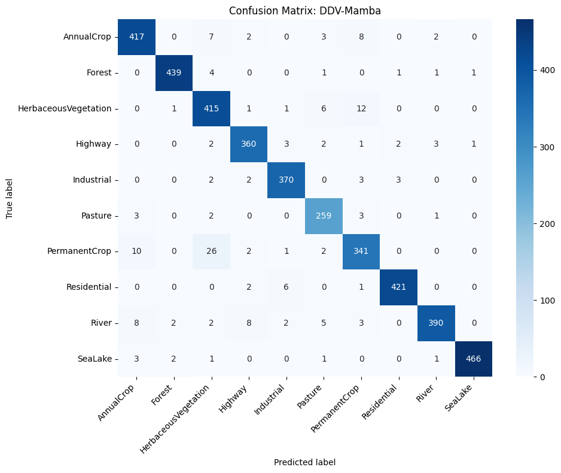
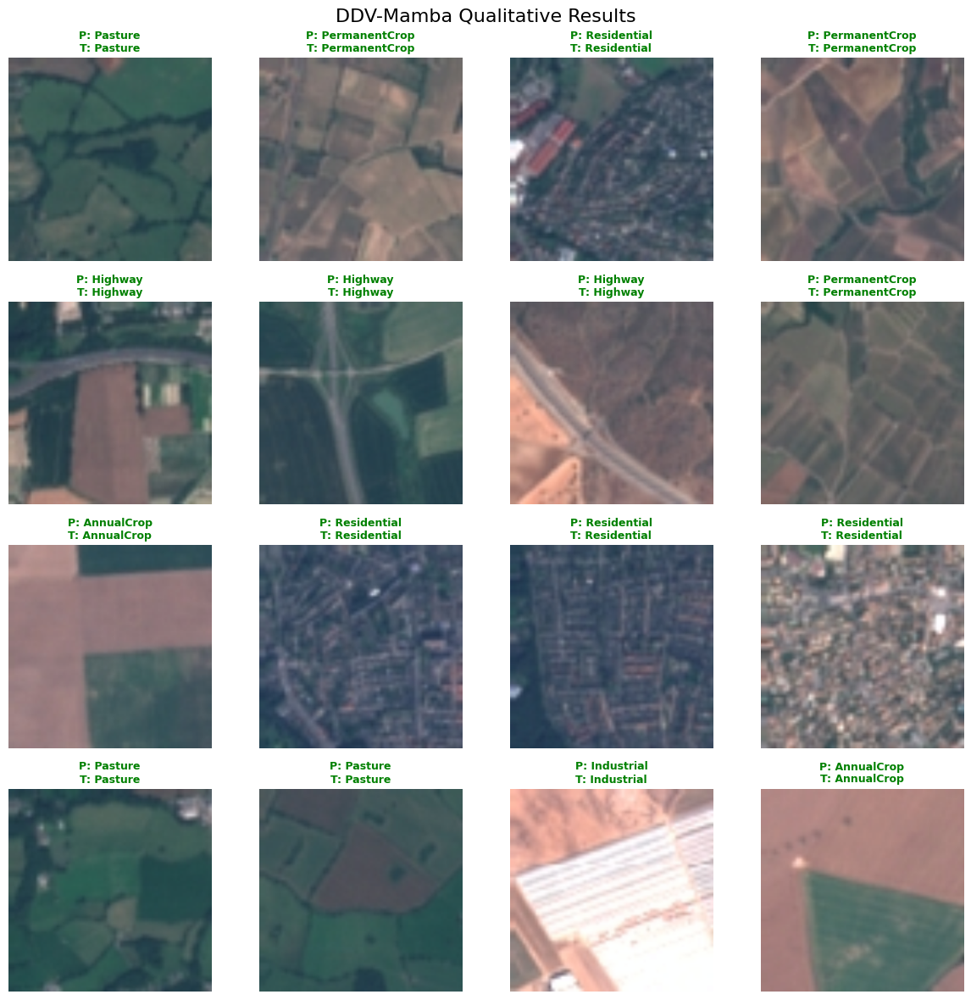

# Deep Delta Vision Mamba (DDV-Mamba) 

> **A Lightweight State Space Architecture for Efficient Remote Sensing Image Classification**

[](#)
[](https://opensource.org/licenses/MIT)
[](https://colab.research.google.com/drive/1US4OA6yhgoQrMuOO06atM90Ncw3Qi3vC?usp=sharing)

>  **Note on Notebook Rendering:** GitHub's built-in file viewer occasionally fails to load `.ipynb` files that contain training progress bars. If `CONECCT.ipynb` does not display correctly below, please click the **Open in Colab** button above to instantly view and run the full code in your browser.

---

Official PyTorch implementation of **DDV-Mamba**, a hierarchical vision model designed specifically for edge-computing and on-board satellite inference. 

By replacing standard residual connections with a novel 2D **Deep Delta Learning (DDL)** operator and utilizing **SSM-Inspired Gated Aggregation**, DDV-Mamba achieves Transformer-level global receptive fields at linear computational complexity.

<p align="center">
  
</p>

## Key Features
* **Deep Delta Block (2D):** Replaces standard additive residuals (y = x + f(x)) with a dynamic erase-and-write gating mechanism, preventing gradient collapse in deep SSM architectures.
* **SSM-Gated Aggregation:** Recovers global context at linear complexity without requiring custom CUDA kernel compilation.
* **Hardware-Aware Design:** Extremely lightweight (5.08M parameters) and highly parallelizable, designed for satellite-grade processors with strict power (<5W) and memory constraints.

## Deployment Efficiency Score (DES)
To evaluate models beyond pure accuracy, we introduce **DES**, a multi-criteria metric rewarding accuracy, throughput (FPS), and compactness:

**DES = (Accuracy × FPS) / Parameters (M)**

### Results on EuroSAT Dataset

| Model | Acc (%) | Params (M) | Throughput (FPS) | DES Score |
| :--- | :---: | :---: | :---: | :---: |
| ViT-B/16 | 97.09 | 86.57 | 52 | 58.3 |
| ResNet50 | 97.42 | 25.56 | 195 | 743.2 |
| EfficientNet-B0 | 97.11 | 5.29 | 260 | 4,772.9 |
| **DDV-Mamba (Ours)** | **96.95** | **5.08** | **510** | **9,733.2** |

*Hardware: NVIDIA T4 GPU (16GB), Batch Size 32, FP32 precision.*

## Ablation Study: The Deep Delta Necessity
Removing the Deep Delta block from the architecture collapses all residual pathways. As shown below, the Deep Delta integration is not just an enhancement—it is a structural necessity that stabilizes the deep SSM network.

| Variant | Test Accuracy | Accuracy Drop |
| :--- | :---: | :---: |
| Base Mamba (No Delta, no residual) | 38.57% | -58.38 pp |
| **DDV-Mamba (Full Model)** | **96.95%** | **-** |

## Visualizations
<p align="center">
  
  
</p>

## Dataset Link 
https://www.kaggle.com/datasets/apollo2506/eurosat-dataset/data

## Quickstart

Because this architecture relies on standard PyTorch operations without custom CUDA kernels, the entire training, evaluation, and ablation pipeline can be run directly from our Jupyter Notebook.

1. Clone the repository or download the `.ipynb` file.
2. Open `CONECCT.ipynb` in Google Colab or your local Jupyter environment.
3. Download the EuroSAT dataset and run the training pipeline.

## Citation
If you find this code or the DES metric useful in your research, please consider citing our paper:

```bibtex
@inproceedings{chhetri2026ddvmamba,
  title={Deep Delta Vision Mamba: A Lightweight State Space Architecture for Efficient Remote Sensing Image Classification},
  author={Chhetri, Latchan and Kumar, Aman},
  booktitle={IEEE CONECCT},
  year={2026}
}
